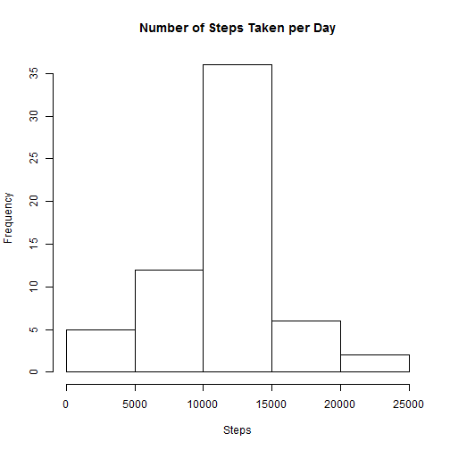

The quantified self movement has lead many individuals to measure information about themselves so that they can set health goals and easily track their progress. As a result of this movement, we have access to real-time data on human activity. The analysis below interprets the activity monitoring dataset to answer the following questions:

* What is mean total number of steps taken per day?
* What is the average daily activity pattern?
* Are there differences in activity patterns between weekdays and weekends?

First, we need to read the data into R:

```r
setwd("C:/Users/Owner/Desktop/Coursera")
d1 <- read.csv("./activity.csv")
summary(d1)
```

```
##      steps                date          interval     
##  Min.   :  0.00   2012-10-01:  288   Min.   :   0.0  
##  1st Qu.:  0.00   2012-10-02:  288   1st Qu.: 588.8  
##  Median :  0.00   2012-10-03:  288   Median :1177.5  
##  Mean   : 37.38   2012-10-04:  288   Mean   :1177.5  
##  3rd Qu.: 12.00   2012-10-05:  288   3rd Qu.:1766.2  
##  Max.   :806.00   2012-10-06:  288   Max.   :2355.0  
##  NA's   :2304     (Other)   :15840
```

Now, let's address our first question:
**What is mean total number of steps taken per day?**

First, we need to remove the empty fields.


```r
d2 <- d1[complete.cases(d1),]
summary(d2)
```

```
##      steps                date          interval     
##  Min.   :  0.00   2012-10-02:  288   Min.   :   0.0  
##  1st Qu.:  0.00   2012-10-03:  288   1st Qu.: 588.8  
##  Median :  0.00   2012-10-04:  288   Median :1177.5  
##  Mean   : 37.38   2012-10-05:  288   Mean   :1177.5  
##  3rd Qu.: 12.00   2012-10-06:  288   3rd Qu.:1766.2  
##  Max.   :806.00   2012-10-07:  288   Max.   :2355.0  
##                   (Other)   :13536
```

Let us first analyze the total number of steps taken each day.

```r
total <- tapply(d2$steps, d2$date, sum)
total
```

```
## 2012-10-01 2012-10-02 2012-10-03 2012-10-04 2012-10-05 2012-10-06 
##         NA        126      11352      12116      13294      15420 
## 2012-10-07 2012-10-08 2012-10-09 2012-10-10 2012-10-11 2012-10-12 
##      11015         NA      12811       9900      10304      17382 
## 2012-10-13 2012-10-14 2012-10-15 2012-10-16 2012-10-17 2012-10-18 
##      12426      15098      10139      15084      13452      10056 
## 2012-10-19 2012-10-20 2012-10-21 2012-10-22 2012-10-23 2012-10-24 
##      11829      10395       8821      13460       8918       8355 
## 2012-10-25 2012-10-26 2012-10-27 2012-10-28 2012-10-29 2012-10-30 
##       2492       6778      10119      11458       5018       9819 
## 2012-10-31 2012-11-01 2012-11-02 2012-11-03 2012-11-04 2012-11-05 
##      15414         NA      10600      10571         NA      10439 
## 2012-11-06 2012-11-07 2012-11-08 2012-11-09 2012-11-10 2012-11-11 
##       8334      12883       3219         NA         NA      12608 
## 2012-11-12 2012-11-13 2012-11-14 2012-11-15 2012-11-16 2012-11-17 
##      10765       7336         NA         41       5441      14339 
## 2012-11-18 2012-11-19 2012-11-20 2012-11-21 2012-11-22 2012-11-23 
##      15110       8841       4472      12787      20427      21194 
## 2012-11-24 2012-11-25 2012-11-26 2012-11-27 2012-11-28 2012-11-29 
##      14478      11834      11162      13646      10183       7047 
## 2012-11-30 
##         NA
```

The maximum steps taken in one day was 21194 and the least amount was 41.


```r
hist(total, main = 'Number of steps taken per day', xlab ='Steps per day')
```

 

According to the histogram above, the mean amount of steps taken in one day looks to be somewhere between 10,000 and 15,000. The true mean and median are as follows:


```r
mean(total, na.rm = T)
```

```
## [1] 10766.19
```

```r
median(total, na.rm = T)
```

```
## [1] 10765
```

Now we will move onto our next analysis:
**What is the average daily activity pattern?**

To address this questions, we need to create a dataset containing the mean number of steps taken within the same interval across each day.

```r
means <- tapply(d2$steps, d2$interval, mean)
d3 <- data.frame(interval = as.numeric(names(means)), steps = as.numeric(means))
```

Now we can observe the daily activity pattern by plotting average number of steps per interval.

```r
plot(d3$steps ~ d3$interval, type = "l", xlab = "Interval", ylab = "Number of Steps", main = "Average Daily Activity Pattern")
```

 

We want to find which interval, across all days, had the highest average amount of steps.

```r
max <- d3[which(d3$steps == max(d3$steps)),]
max$interval
```

```
## [1] 835
```

The participants appear to have been most active during interval 835.


Before we approach our final question, we will revisit our first analysis.

```r
summary(d1)
```

```
##      steps                date          interval     
##  Min.   :  0.00   2012-10-01:  288   Min.   :   0.0  
##  1st Qu.:  0.00   2012-10-02:  288   1st Qu.: 588.8  
##  Median :  0.00   2012-10-03:  288   Median :1177.5  
##  Mean   : 37.38   2012-10-04:  288   Mean   :1177.5  
##  3rd Qu.: 12.00   2012-10-05:  288   3rd Qu.:1766.2  
##  Max.   :806.00   2012-10-06:  288   Max.   :2355.0  
##  NA's   :2304     (Other)   :15840
```
There were 2,304 NAs. We want to be sure we were not introducing unnecessary bias by removing all of these incomplete rows.

Instead, we will replace these NA's with the average number of steps taken during the corresponding interval.

```r
d4 <- d1
for (i in 1:length(d4$steps)) {
  if (is.na(d4$steps[i]) == T) {
    d4$steps[i] <- d3$steps[which(d3$interval == d4$interval[i])]
  }
}
```

Now let's reproduce our original analysis and compare the results.

```r
total2 <- tapply(d4$steps, d4$date, sum)
hist(total2, main = "Number of Steps Taken per Day", xlab = "Steps")
```

 

```r
mean(total2)
```

```
## [1] 10766.19
```

```r
median(total2)
```

```
## [1] 10766.19
```

The means are the same with and without the imputed values, while the median is also virtually the same.


```r
sum(d3$steps)
```

```
## [1] 10766.19
```

```r
tot <- tapply(d1$steps, d1$date, sum)
tot <- as.data.frame(tot)
str(tot)
```

```
## 'data.frame':	61 obs. of  1 variable:
##  $ tot: int [1:61(1d)] NA 126 11352 12116 13294 15420 11015 NA 12811 9900 ...
##   ..- attr(*, "dimnames")=List of 1
##   .. ..$ : chr  "2012-10-01" "2012-10-02" "2012-10-03" "2012-10-04" ...
```

```r
t <- tot[complete.cases(tot),]
str(t)
```

```
##  int [1:53(1d)] 126 11352 12116 13294 15420 11015 12811 9900 10304 17382 ...
##  - attr(*, "dimnames")=List of 1
##   ..$ : chr [1:53] "2012-10-02" "2012-10-03" "2012-10-04" "2012-10-05" ...
```
There were 8 days with no data, in which we imputed new values for these fields. These fields are now populated with the sum of the average number of steps for each interval (10766.19). Both the mean and median for our new data set containing our imputed values also reflect this value. Since the mean and median values for both data sets were so similar, we can conclude that there was little bias either way. Although, it should be noted that it does not necessarily make sense to have a median of 10,766.19 as we did not measure partial steps.

And now for our final analysis:
**Are there differences in activity patterns between weekdays and weekends?**

In order to address this question, we need to make some changes to our data set.

```r
d4$asDates <- as.Date(d4$date)
d4$weekday <- weekdays(d4$asDates)
head(d4)
```

```
##       steps       date interval    asDates weekday
## 1 1.7169811 2012-10-01        0 2012-10-01  Monday
## 2 0.3396226 2012-10-01        5 2012-10-01  Monday
## 3 0.1320755 2012-10-01       10 2012-10-01  Monday
## 4 0.1509434 2012-10-01       15 2012-10-01  Monday
## 5 0.0754717 2012-10-01       20 2012-10-01  Monday
## 6 2.0943396 2012-10-01       25 2012-10-01  Monday
```
We now have two new variables: one in which our dates are in class "Date," and one that specifies the day of the week that date fell on. But we still need to create a factor variable that classifies the days of the week as a weekday or a weekend.

```r
d4$factor <- rep("weekday", length(d4$weekday))
for (i in 1:length(d4$weekday)) {
  if(d4$weekday[i] == "Saturday") {
    d4$factor[i] <- "weekend"
  }
  if(d4$weekday[i] == "Sunday") {
    d4$factor[i] <- "weekend"
  }
}
d4$factor <- as.factor(d4$factor)
str(d4)
```

```
## 'data.frame':	17568 obs. of  6 variables:
##  $ steps   : num  1.717 0.3396 0.1321 0.1509 0.0755 ...
##  $ date    : Factor w/ 61 levels "2012-10-01","2012-10-02",..: 1 1 1 1 1 1 1 1 1 1 ...
##  $ interval: int  0 5 10 15 20 25 30 35 40 45 ...
##  $ asDates : Date, format: "2012-10-01" "2012-10-01" ...
##  $ weekday : chr  "Monday" "Monday" "Monday" "Monday" ...
##  $ factor  : Factor w/ 2 levels "weekday","weekend": 1 1 1 1 1 1 1 1 1 1 ...
```

I'm now going to create two subsets (one consisting of weedays and the other of weekends) so that I may take the average steps taken per interval across all the days for each. Then we need to merge the subsets so as to create one graph depicting the difference in activity on weekdays versus weekends.

```r
wday <- d4[which(d4$factor == "weekday"),]
wend <- d4[which(d4$factor == "weekend"),]

means_wday <- tapply(wday$steps, wday$interval, mean)
means_wday <- data.frame(interval = names(means_wday), steps = means_wday, factor = rep("weekday", length(means_wday)))

means_wend <- tapply(wend$steps, wend$interval, mean)
means_wend <- data.frame(interval = names(means_wend), steps = means_wend, factor = rep("weekend", length(means_wend)))

d5 <-NULL
d5 <- merge(means_wday, means_wend, all = T)
str(d5)
```

```
## 'data.frame':	576 obs. of  3 variables:
##  $ interval: Factor w/ 288 levels "0","10","100",..: 1 1 2 2 3 3 4 4 5 5 ...
##  $ steps   : Named num  0.2146 2.2512 0.0165 0.1732 0.0401 ...
##   ..- attr(*, "names")= chr  "0" "0" "10" "10" ...
##  $ factor  : Factor w/ 2 levels "weekday","weekend": 2 1 2 1 2 1 1 2 1 2 ...
```


```r
library(lattice)
x.tick.number <- 10
at <- seq(1, nrow(d5), length.out=x.tick.number)
xyplot(d5$steps ~ d5$interval | d5$factor, layout = c(1,2), type = 'l', scales=list(x=list(at = NULL)), xlab = "Interval", ylab = "Steps", main = "Activity Patterns")
```

 

Judging by the graph above, the participant had very similar activity patterns on weekdays as on weekends. Overall, however, he/she appears to be slightly more active earlier on in the day on weekends and more active later in the day on weekdays.
